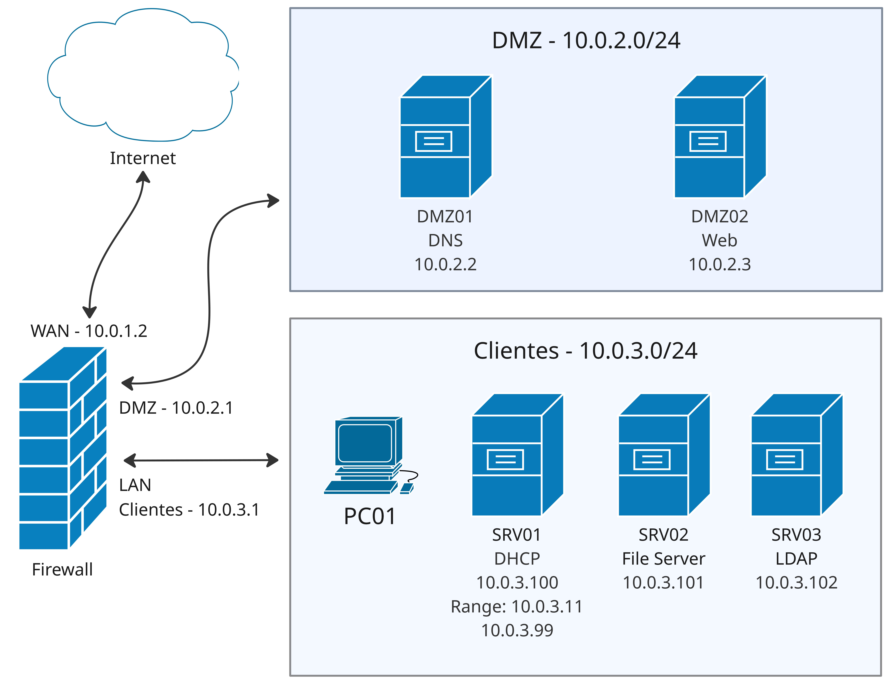

# Rede Linux

Este projeto tem o objetivo de criar uma rede de computadores usando somente servidores Linux com o sistema operacional **Debian 13 (Trixie)**.
<!-- 
[Post no blog](https://blog.ferpdias.com.br/projetos/rede_linux/)
-->
 

## Diagrama do projeto:

 

Esta rede está dividida em 03 redes diferentes:

- Internet: `10.0.1.0/24`
- DMZ: `10.0.2.0/24`
- LAN Clientes: `10.0.3.0/24` 

 

### Firewall 

O **Firewall** será gerenciado pelo [nftables](https://wiki.nftables.org/).
- IP WAN: `10.0.1.2/24` 
  - IP GW: `10.0.1.1`
- IP DMZ: `10.0.2.1/24`
- IP LAN Clientes: `10.0.3.1/24`

 

### Rede DMZ 

A rede "DMZ" tem 02 servidores: 

#### DNS

- Software: [Bind 9](https://www.isc.org/bind/)
- Hostname: `DMZ01` 
- IP: `10.0.2.2/24` 

 

#### Web

- Software: [NGINX](https://nginx.org/)
- Hostname: `DMZ02` 
- IP: `10.0.2.3/24` 

 

### Rede Clientes 

A rede "Clientes" é para os usuário e tem 03 servidores: 
## DHCP Server

- Software: [Kea DHCP](https://www.isc.org/kea/)
- Hostname: `SRV01` 
- IP: `10.0.3.100/24` 
- Range de IPs: 10.0.3.11 - 10.0.3.99

 

#### File Server

- Software: [Samba](https://www.samba.org/)
- Hostname: `SRV02` 
- IP: `10.0.3.101/24` 

 

#### LDAP

- Software: [OpenLDAP](https://openldap.org/software/download/)
- Hostname: `SRV03` 
- IP: `10.0.3.102/24` 
